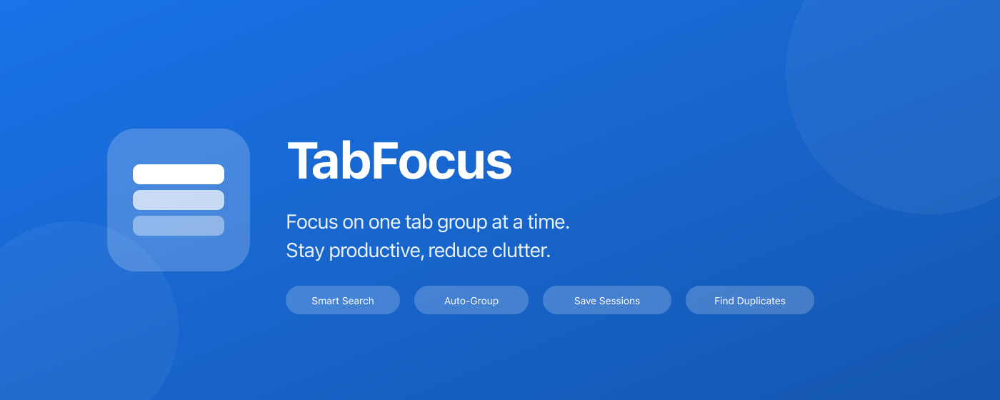

<p align="center">
  
</p>

<h1 align="center">TabFocus</h1>

<p align="center">
  <strong>Focus on one tab group at a time. Stay productive, reduce clutter.</strong>
</p>

<p align="center">
  <a href="https://github.com/geledek/TabFocus/blob/main/LICENSE">
    
  </a>
  
  
  
  
  
</p>

<p align="center">
  <a href="#features">Features</a> •
  <a href="#installation">Installation</a> •
  <a href="#usage">Usage</a> •
  <a href="#contributing">Contributing</a>
</p>

---

## Features

### Core Features (P0)
- **View One Group at a Time** - Focus on a single tab group while hiding others
- **Create/Name/Color Groups** - Full control over tab groups with 8 Chrome colors
- **Persistent Group Save** - Auto-save and restore tab groups across browser sessions

### Search & Navigation (P1)
- **Quick Tab Search** - Fast fuzzy search across all tabs
- **Session Save/Restore** - Save and restore complete browsing sessions
- **Auto-Group by Domain** - Automatically group tabs from the same website

### Power User Features (P2)
- **Duplicate Tab Detection** - Find and merge duplicate tabs
- **Keyboard Shortcuts** - Quick access via Ctrl+1-9, Ctrl+Shift+F, etc.
- **Tab Suspension** - Memory saver for inactive tabs

## Installation

### Development Mode

1. Clone the repository:
   ```bash
   git clone https://github.com/geledek/TabFocus.git
   cd TabFocus
   ```

2. Install dependencies:
   ```bash
   npm install
   ```

3. Build the extension:
   ```bash
   npm run build
   ```

4. Load in Chrome:
   - Open Chrome and navigate to `chrome://extensions/`
   - Enable "Developer mode" (toggle in top right)
   - Click "Load unpacked"
   - Select the `dist` folder

### Development Workflow

```bash
npm run dev    # Watch mode - rebuilds on file changes
npm run build  # Production build
npm test       # Run tests
npm run clean  # Remove dist folder
```

## Usage

### Opening TabFocus
- Click the TabFocus icon in Chrome toolbar
- Use keyboard shortcut: `Ctrl+Shift+Y` (Windows) / `Cmd+Shift+Y` (Mac)

### Keyboard Shortcuts
| Shortcut | Action |
|----------|--------|
| `Ctrl/Cmd + Shift + Y` | Open TabFocus popup |
| `Ctrl/Cmd + Shift + U` | Show all groups |

*Customize shortcuts at `chrome://extensions/shortcuts`*

### Creating Groups
1. Click "New Group" button
2. Enter a name and select a color
3. The current tab will be added to the new group

### Focusing on a Group
1. Click the eye icon next to any group
2. All other groups will be hidden
3. Click "Exit Focus Mode" or "Show All" to reveal all groups again

## Project Structure

```
tabfocus/
├── manifest.json           # Extension manifest (Manifest V3)
├── src/
│   ├── popup/             # Popup UI
│   │   ├── popup.html
│   │   ├── popup.ts
│   │   └── popup.css
│   ├── background/        # Service worker
│   │   └── service-worker.ts
│   ├── options/           # Settings page
│   │   ├── options.html
│   │   ├── options.ts
│   │   └── options.css
│   ├── lib/               # Shared utilities
│   │   ├── storage.ts
│   │   ├── logger.ts
│   │   └── utils.ts
│   ├── types/             # TypeScript types
│   │   └── index.ts
│   └── assets/            # Icons and images
│       └── icons/
├── dist/                  # Built extension (load this in Chrome)
├── webpack.config.js
├── tailwind.config.js
└── tsconfig.json
```

## Permissions

This extension requires the following permissions:
- `tabs` - Read tab information
- `tabGroups` - Manage tab groups
- `storage` - Save settings and sessions
- `alarms` - Auto-save functionality

## Contributing

1. Fork the repository
2. Create a feature branch
3. Make your changes
4. Run tests: `npm test`
5. Submit a pull request

## License

MIT
